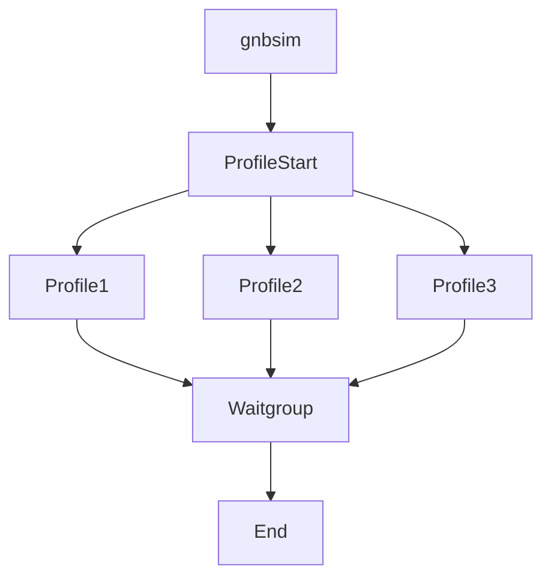

<!--
SPDX-FileCopyrightText: 2022 Great Software Laboratory Pvt. Ltd

SPDX-FileCopyrightText: 2021 Open Networking Foundation <info@opennetworking.org>

SPDX-License-Identifier: Apache-2.0

-->

# Call Flow Parallel Profile



# Call Flow In sequence Profile

```mermaid
graph TD
    Gnbsim --> ProfileStart;
    ProfileStart --> Profile1 :Hi 
    Profile1 --> ProfileStart;
    ProfileStart --> Profile2;
    Profile2 --> ProfileStart;
    ProfileStart --> Profile3;
    Profile3 --> ProfileStart;
    ProfileStart --> End;
```
